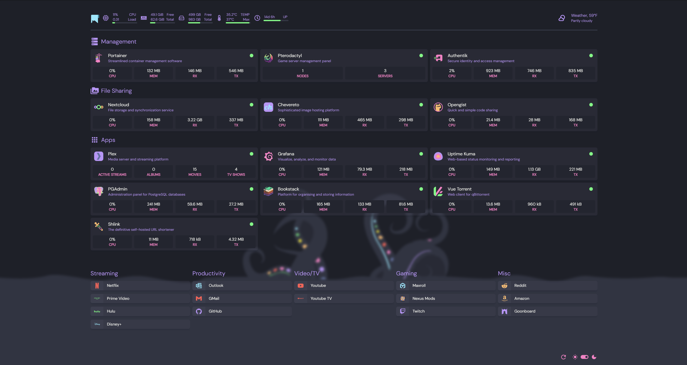

# Dracula for [Homepage](https://github.com/gethomepage/homepage)

> A dark theme for [Homepage](https://github.com/gethomepage/homepage) with Dracula styled icons.

⚠️ Additional icons are being worked on; please [open a request issue](https://github.com/dracula/homepage-app/issues/new) if you want specific icons faster.

## Install

All instructions can be found at [draculatheme.com/homepage-app](https://draculatheme.com/homepage-app).

## Team

This theme is maintained by the following person(s) and a bunch of [awesome contributors](https://github.com/dracula/foobar/graphs/contributors).

|  |
| --------------------------------------------------------------------------------------------- |
| [Jas Singh](https://github.com/Jas-SinghFSU)                                                  |

## Community

- [Twitter](https://twitter.com/draculatheme) - Best for getting updates about themes and new stuff.
- [GitHub](https://github.com/dracula/dracula-theme/discussions) - Best for asking questions and discussing issues.
- [Discord](https://draculatheme.com/discord-invite) - Best for hanging out with the community.

## License

[MIT License](./LICENSE)
